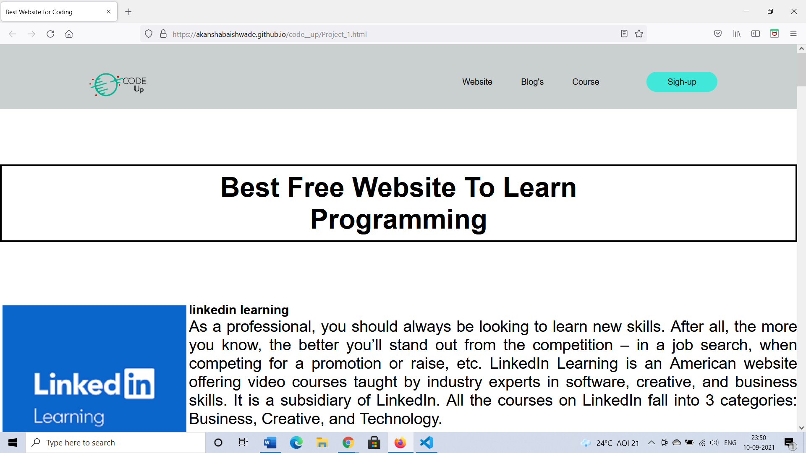

# Code up

  
<ffffffffffffff/p>
   

  
   

It opens in both desktop and mobile here is the view.

## Purpose ##

The purpose of creating this [(Live)](https://akanshabaishwade.github.io/code__up/Project_1.html) website is to facilitate the user to get all the information related to coding in one platform.

This is the source code of Code up [Code](https://github.com/akanshabaishwade/Code_up)
I have created this webpage using [Visual Studio Code](https://code.visualstudio.com/).

